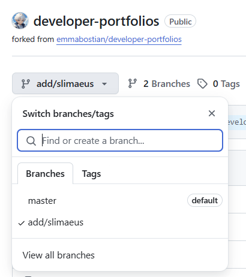

1. Click to the fork button on the repository

1. Create the fork

1. Create a new branch (i.e `add/your-name`)

1. Switch to your new branch

1. Go to `README.md`

1. Click edit button

1. Add your new site. Remember to add alphabetically to the list.

1. Commit changes


1. Go to `Pull requests` and create a new pull request

You can choose `Compare & pull request` or `New pull request`
    - `New pull request`: Change the compare to your new branch and click `Create pull request`
    
    
1. Update the message and create the pull request

    :::note
    Here's my message:
    ```md
    Added my portfolio site under the "S" section in alphabetical order: [Slimaeus](https://slimaeus.github.io/about) [.NET Developer]
    Hope you you take a look. Thank you.
    ```
    :::
1. Waiting for the author's approval
---
> ### References
> - [Official Guide](https://github.com/emmabostian/developer-portfolios/blob/master/CONTRIBUTING.md)