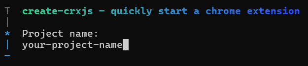
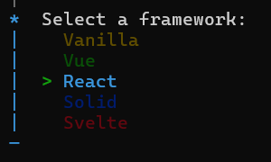
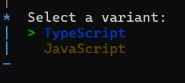
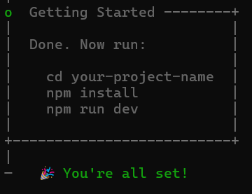

## Prerequisites
- [Node.js](https://nodejs.org/en)
- Node.js package manager (npm, yarn, pnpm)
---
## Steps
1. Go to the folder you want to create and run command
    ```bash
    npx create-cxjs
    ```
1. Enter your project name

    :::note
    Change `your-project-name` with your project name
    :::
1. Select `React`

1. Select `Typescript`

1. Done

---
> ### References
> - [How to install CRXJS](https://crxjs.dev/guide/installation/create-crxjs)